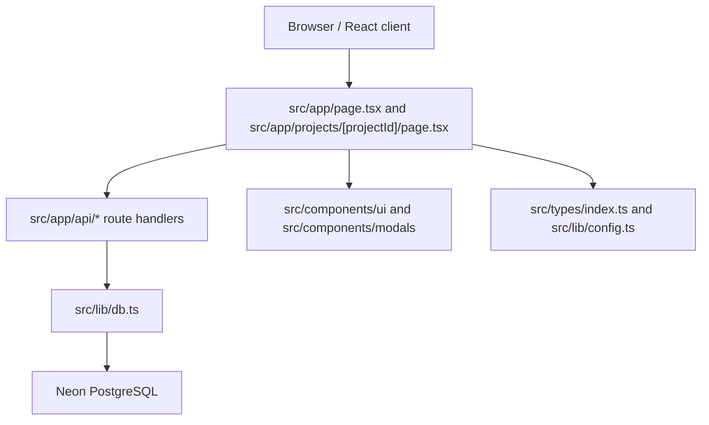

# Guia compacta del proyecto

Esta guia resume como esta armado el sistema y que reglas debe seguir cualquier dev o agente antes de cambiarlo.

## Producto

QA Bug Tracker Dashboard es una herramienta interna para gestionar reportes de bugs por proyecto. Permite crear proyectos, registrar bugs, adjuntar evidencia en imagen, editar evidencia, filtrar por estado, cambiar entre vistas `cards`, `list` y `kanban`, y exportar reportes PDF.

## Stack

- Next.js `16` con App Router.
- React `19` y TypeScript estricto.
- Tailwind CSS `4`.
- Neon PostgreSQL via `@neondatabase/serverless`.
- Heroicons para iconografia.
- `jspdf` para PDF; `exceljs` existe pero hoy no esta conectado a la UI.

## Arquitectura

### Capas

- UI de pagina: vive en `src/app`. Las paginas actuales son client components porque manejan formularios, uploads, drag/drop, localStorage y modales.
- API interna: vive en `src/app/api`. Es la frontera entre cliente y servidor.
- Persistencia: vive en `src/lib/db.ts`. Es server-only, crea schema si falta y traduce rows SQL a tipos del dominio.
- Dominio: vive en `src/types/index.ts` y `src/lib/config.ts`.
- Componentes base: viven en `src/components/ui` y se reexportan desde `src/components/index.ts`.

## Modelo de datos

Entidades principales:

- `Project`: `id`, `name`, `description`, `color`, `icon`, `actors`, `createdAt`.
- `TestRecord`: bug/reporte con `projectId`, `actor`, `modulo`, `tipoError`, `device`, `resolution`, `titulo`, pasos, resultados, `evidencia`, `estado`, `notasDev`, `fechaCreacion`.

Persistencia:

- Tabla `projects`.
- Tabla `records`, con `project_id` FK a `projects.id` y `ON DELETE CASCADE`.
- `evidencia` se guarda como JSONB; las imagenes se almacenan como data URL/base64. Esto simplifica el producto, pero puede crecer rapido en DB.

Reglas de datos:

- `DATABASE_URL` solo se lee en servidor.
- El proyecto `sumo` es el proyecto default y la capa DB evita eliminarlo.
- `DELETE /api/records` borra todos los registros globales.
- Los valores de estado, tipo de error, actor y dispositivo deben venir de `src/lib/config.ts` y los tipos de `src/types/index.ts`.

## API

Proyectos:

- `GET /api/projects`: lista proyectos.
- `POST /api/projects`: crea proyecto. Si se envia `id`, usa `createProjectWithId`; si no, genera ID `proj-*`.
- `GET /api/projects/:id`: obtiene un proyecto.
- `PATCH /api/projects/:id`: actualiza proyecto.
- `DELETE /api/projects/:id`: elimina proyecto y sus records por cascade.

Records:

- `GET /api/records`: lista todos los records.
- `GET /api/records?projectId=...`: lista records por proyecto.
- `POST /api/records`: crea bug.
- `PATCH /api/records/:id`: actualiza bug.
- `DELETE /api/records/:id`: elimina bug.
- `DELETE /api/records`: elimina todos los bugs.

## Flujos UI

- Home (`/`): carga proyectos, calcula conteos por proyecto llamando `/api/records?projectId=...` y permite crear proyectos.
- Proyecto (`/projects/[projectId]`): asegura que exista `sumo`, carga proyectos y records del proyecto activo, administra formularios y vistas.
- Evidencia: acepta imagenes por upload, drop o paste; se guarda como data URL. `ImageEditor` edita sobre canvas.
- Vistas: el modo `cards/list/kanban` se guarda en `localStorage` con key `bug-tracker-view-mode`.
- Exportacion: `downloadPDF(records, projectName)` genera un PDF por registros visibles del proyecto.

## Estilo visual

Nombre de estilo actual: `QA Pulse`.

Principios:

- Inter como fuente global.
- Fondo claro (`slate-50`, `gray-50`) y superficies blancas.
- Color primario principal: `#263a5f`.
- Bordes sutiles `border-slate-200`, sombras suaves y estados hover discretos.
- Iconos desde `@heroicons/react/24/outline`.
- Usar `Button`, `Card`, `Badge`, `Input`, `Modal`, `Spinner`, `SkeletonLoader` e `ImageEditor` antes de crear variantes locales.
- Mantener formularios densos pero legibles; el producto es una herramienta operacional, no una landing page.
- Los gradientes existen como acentos de identidad de proyecto, no como fondo dominante.

## Reglas de componentes

- Importar componentes desde `@/components` cuando sea posible.
- Componentes base estan en `src/components/ui`; dialogos en `src/components/modals`.
- Evitar duplicar componentes compartidos. Nota: existe `src/components/Modal.tsx` legacy; el barrel actual usa `src/components/modals/Modal.tsx`.
- Mantener props tipadas y simples. Si una variante visual se repite, agregarla al componente base.
- Para nuevos icon buttons, usar Heroicons y `title`/`aria-label` cuando el texto no sea visible.

## Reglas de implementacion

- No traer acceso DB al cliente. Cliente -> `/api/*` -> `src/lib/db.ts`.
- No crear otro cliente de base de datos fuera de `src/lib/db.ts` sin una razon fuerte.
- Para nuevos campos de bug/proyecto, actualizar en este orden:
  1. `src/types/index.ts`
  2. `src/lib/db.ts` schema y mappers
  3. API route si aplica
  4. UI y formularios
  5. docs relevantes
- Mantener `@/*` como alias de imports.
- Usar Tailwind inline como patron actual; extraer solo si reduce duplicacion real.
- No basarse en `src/data/database.json`; es un vestigio vacio.

## Analisis y riesgos actuales

- `src/app/projects/[projectId]/page.tsx` concentra demasiada logica: CRUD, filtros, kanban, modales, uploads y exportacion. Para cambios grandes, conviene extraer hooks/componentes por flujo.
- No hay tests automatizados. Al tocar API o DB, minimo correr `npm run lint` y `npm run build`.
- Las API routes tienen validacion ligera. Antes de exponer el producto a usuarios no confiables, agregar validacion de payload y autenticacion/autorizacion.
- Guardar imagenes base64 en Postgres es simple pero puede impactar costo/tamano. Para mucho volumen, mover evidencia a storage y guardar URLs.
- Algunos archivos parecen legacy o no usados directamente: `src/lib/firebase.ts`, `src/lib/excel.ts`, `src/lib/projects.ts`, `src/lib/theme.ts`, `src/data/database.json`, `src/components/Modal.tsx`. No eliminarlos sin revisar historial y flujo esperado.

## Checklist antes de entregar cambios

- `npm run lint`
- `npm run build`
- Probar manualmente crear proyecto, crear bug, editar estado, adjuntar evidencia y exportar PDF cuando el cambio toque esos flujos.
- Revisar que no se agregaron secretos ni `.env*`.
